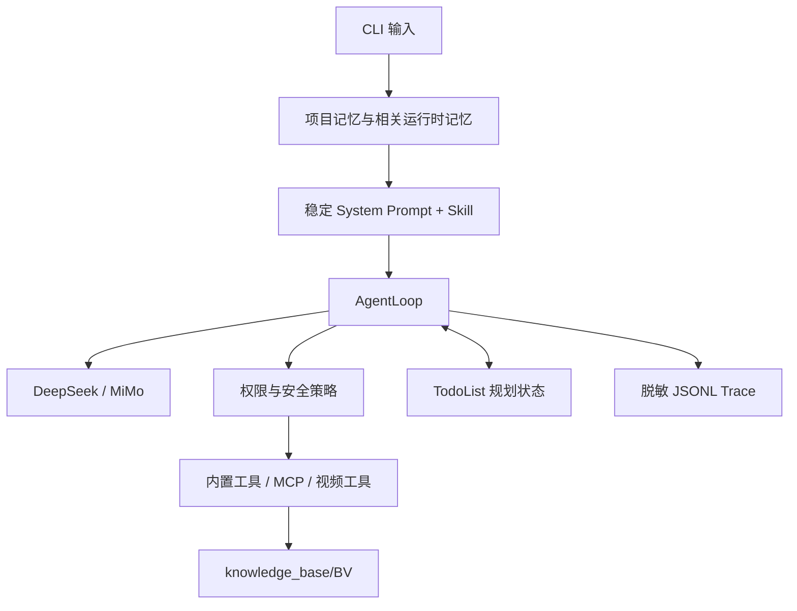

# mini-OpenClaw 架构

## 总览

## 核心层

- **Backend**：把 OpenAI-compatible 响应归一化为 `content/tool_calls/usage`。
- **AgentLoop**：执行 ReAct 循环、工具回填、compaction、重试、反思和停止判断。
- **Tools/MCP**：提供文件、Shell、网页、记忆、规划和视频提取能力。
- **Skills**：按任务召回领域工作流；视频任务只加载 `video-summary`。
- **Security**：三级权限、工作区路径限制、bubblewrap、外部数据边界和出站白名单。
- **Memory**：`MEMORY.md` 保存脱敏项目约定，私有 JSON 保存用户明确要求记住的偏好。
- **Planning**：单次运行独立 Todo 状态，支持失败恢复和无进展停止。
- **Observability**：记录 LLM/tool span、token、耗时、权限拒绝和 Todo 进度。

## 视频数据流

`video_probe -> video_transcribe -> read transcript -> 可选 OCR -> 类型判断 -> kb_write`。知识点只能来自 metadata、transcript 和 OCR；搜索结果不能冒充视频内容。产物统一位于 `knowledge_base/<BV>/`。

## 信任边界

网页、文件、字幕和 OCR 使用 `<external>` 标记。运行时记忆低于当前用户指令和安全策略。模型不能通过 transcript、记忆或 Todo 提升工具权限。

## 当前界面边界

正式验收入口是 `python -m agent.cli`。Textual TUI 使用独立流式链路，尚未同步 Day7-Day9 的记忆、规划与 trace 状态。
