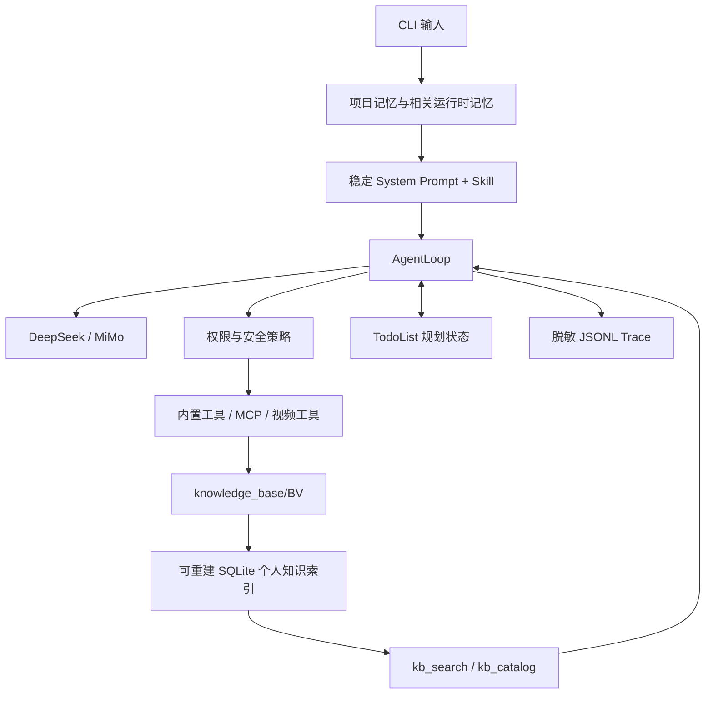

# mini-OpenClaw 架构

## 总览

## 核心层

- **Backend**：把 OpenAI-compatible 响应归一化为 `content/tool_calls/usage`。
- **AgentLoop**：执行 ReAct 循环、工具回填、compaction、重试、反思和停止判断。
- **Tools/MCP**：提供文件、Shell、网页、记忆、规划和视频提取能力。
- **Skills**：按任务召回领域工作流；`video-summary` 负责入库，`personal-video-knowledge` 负责历史知识问答。
- **Security**：三级权限、工作区路径限制、bubblewrap、外部数据边界和出站白名单。
- **Memory**：`MEMORY.md` 保存脱敏项目约定，私有 JSON 保存用户明确要求记住的偏好。
- **Planning**：单次运行独立 Todo 状态，支持失败恢复和无进展停止。
- **Observability**：记录 LLM/tool span、token、耗时、权限拒绝和 Todo 进度。

## 关键设计决策

- **Tool 与 Skill 分离**：Tool 是有 JSON Schema 的原子动作；Skill 是按任务召回的流程说明。视频 Skill 只负责编排，不绕过工具权限。
- **精确编辑**：`edit` 仅在 `old` 唯一匹配时替换。零匹配和多匹配都返回 observation，让模型扩大上下文后重试，避免误改。
- **两层记忆**：跟踪的 `MEMORY.md` 保存稳定项目约定；被 Git 忽略的 JSON 仅保存用户明确要求记住的短偏好。原始 transcript、网页和密钥不进入记忆。
- **可选规划**：简单任务可关闭 Todo；复杂任务可强制先规划。Todo 每次运行独立，历史中的规划工具消息会在下一轮前删除。
- **有界恢复**：幂等工具的瞬时错误最多重试 3 次；相同调用连续 3 次会被阻断；Todo 长期无推进或达到最大轮数时明确停止。
- **上下文压缩**：超预算时摘要旧历史并保留最近轮次；长 transcript 单次读取上限高于普通 observation，但不会无限进入上下文。

## 视频数据流

`video_probe -> 匿名字幕 -> 扫码登录字幕 -> 用户确认 ASR -> read transcript -> 可选 OCR -> 类型判断 -> kb_write`。登录入口不注册为 Agent Tool；课程镜像为每个 `AgentRuntime` 创建独立的 30 分钟内存登录态，个人本地仍可使用 persistent 存储。登录态只发送给B站字幕接口，媒体下载保持匿名。知识点只能来自 metadata、transcript 和 OCR。

字幕/ASR 完成后由 Tool 统计有效片段、字符、语音时长和重复率。证据不足时 `kb_write` 忽略模型传入的摘要与要点，固定生成诊断型 `index.md`、零 chunks，并从检索索引移除；因此“没内容不编造”不依赖模型服从提示词。OCR 优先使用本地 EasyOCR，缺失时最多向已配置视觉模型发送 6 张压缩关键帧，两者都不可用时明确降级。

`kb_write` 按完整字幕段和分 P 生成带时间范围的 chunks，并增量更新 `.mini-openclaw/video_knowledge.sqlite3`。该数据库只是派生缓存，原始知识文件仍是事实来源，可随时执行 `python -m tools.knowledge --reindex` 重建。

索引 v2 保存 transcript SHA-256、SimHash、重复关系和 schema version。精确重复只保留一个 searchable canonical，近似内容仅提示；检索使用 BM25 召回、查询覆盖率阈值、单视频上限和 token Jaccard MMR 重排。

个人知识问答只暴露 `kb_search`、`kb_catalog`、只读记忆和规划工具。知识治理使用独立管理 Skill，只额外暴露需确认的软删除、恢复、导出和永久清理 Tool，不开放 Shell、网络、MCP 或视频下载。

## 信任边界

网页、文件、字幕和 OCR 使用 `<external>` 标记。运行时记忆低于当前用户指令和安全策略。模型不能通过 transcript、记忆或 Todo 提升工具权限。

### 安全机制

`ToolPolicy` 在执行前给出 `allow/confirm/deny`。文件路径经 `resolve()` 后限制在工作区，并拒绝 `.git`、`.ssh`、`.env`、密钥文件和符号链接逃逸。Linux Shell 在危险命令前置拦截后进入 bubblewrap：系统只读、工作区可写、网络隔离。`web_fetch` 只允许 HTTP(S) 白名单域名并逐跳校验重定向。视频任务进一步隐藏通用写入、Shell 和 MCP 写工具，只能写对应 BV 目录。

## 可观测性与成本

每次 CLI/TUI 运行默认写入 `.mini-openclaw/traces/*.jsonl`，记录 LLM、工具、权限、规划与错误恢复 span。记录内容会截断并脱敏，不保存 API Key 或图片 Base64。API `usage` 被保留为 prompt、completion 和 total token；配置 `MODEL_INPUT_USD_PER_1M`、`MODEL_OUTPUT_USD_PER_1M` 后可估算成本并找出最贵 LLM 步骤。`--replay-trace` 用于现场回放，公共前缀长度用于观察缓存友好程度。

## 失败恢复路径

工具错误不会抛出到进程顶层，而是作为 tool observation 回填。模型获得最多两次反思机会，可修正参数、插入 Todo 或标记 blocked。空模型响应只重试一次；TUI 等待 `worker_finished` 后才解除 busy，防止后台任务与新任务并发共享 Runtime。

## 当前界面边界

`python -m agent.cli` 与 `mini-openclaw` 都通过共享 `AgentRuntime` 组装 backend、工具、MCP、Skill、Memory、Todo、权限策略和 trace。TUI 使用 `AgentLoop` 的结构化事件显示流式文本、工具状态和产物，不再维护独立 ReAct 循环。

TUI 会话经脱敏和限长后原子写入 `.mini-openclaw/sessions/`，不持久化图片 Base64 或密钥。模型切换只接受环境变量配置的白名单别名。`!command` 也进入统一 `ToolPolicy -> confirm/deny -> bubblewrap -> trace` 链路，不存在绕过模型就绕过安全层的旁路。
